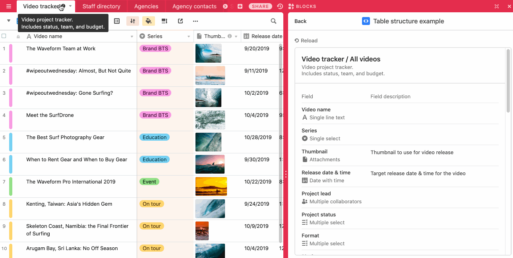

# Table structure app

This example app and shows the table description as well as field names, descriptions, types and
options for the table and view the user is currently viewing.

The code shows:

-   How to use the Cursor API to detect which table and view the user is viewing.

-   How to use the `useBase` and `useViewMetadata` hooks to read and watch for changes to base and
    view metadata.

-   How to display table and field metadata, including names, descriptions, and field types.

-   How to use `@airtable/blocks/ui` components like `<Box>`, `<Heading>`, `<Text>` and
    `<FieldIcon>` to style your app.

## How to run this app

1. Create a new base using the
   [Digital video production template](https://airtable.com/templates/content-production/expKOGNEdcF0gmFW3/digital-video-production).
   (You can also use an existing base or a different template: this app doesn't depend on any
   specific attributes from that template.)

2. Create a new app in your new base (see
   [Create a new app](https://airtable.com/developers/blocks/guides/hello-world-tutorial#create-a-new-app)),
   selecting "Table structure" as your template.

3. From the root of your new app, run `block run`.

Note: The template base does not have table or field descriptions set. It's expected for the app to
initially look a bit empty!

## See the app running

